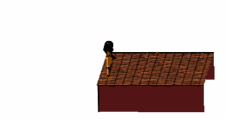

# Animation in Maple

## CEGEP Calculus 3 (Multivariable calculus) project

This is the work I did in a competition in CEGEP where we had to do an animation using a mathematics program (MAPLE). I won the first place and 200$ (250$ total for the team). There is a link to the newspaper where we can see it:

http://www.laction.com/Communaute/2015-05-25/article-4158443/Des-etudiants-demontrent-leur-savoir-faire/1

The animation was created using basic shapes and alterating them. Movement is made trought translations and rotation of each elements.

Notes:
A lot of the work was invested in making Samus walk. Most of the features in the end of the animation were added to satifies the requirement of the work.
